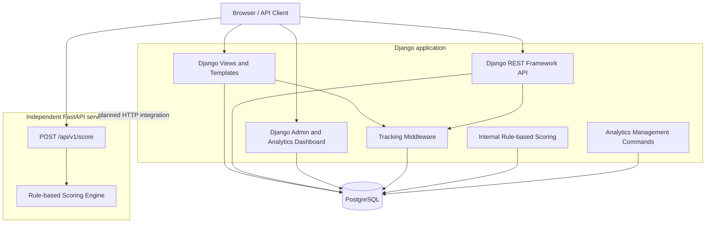
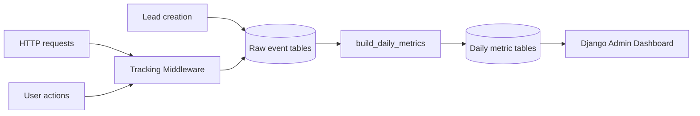

# B2B E-Commerce & Analytics Platform

[](https://www.python.org/)
[](https://www.djangoproject.com/)
[](https://www.django-rest-framework.org/)
[](https://fastapi.tiangolo.com/)
[](https://www.postgresql.org/)
[](https://www.docker.com/)
[](https://github.com/BulatKSMNT/django-b2b-ecommerce/actions)

Backend-платформа для B2B-заказов с каталогом, корзиной, заявками,
server-side tracking, аналитическими витринами и rule-based скорингом лидов.

Проект включает основное приложение на **Django/DRF**, отдельный
асинхронный scoring-сервис на **FastAPI**, базу данных **PostgreSQL**,
контейнеризацию и автоматические тесты.

> Портфолио-проект, разработанный для демонстрации проектирования backend-систем,
> REST API, обработки данных, аналитических агрегатов и сервисной архитектуры.

## Ключевые технические задачи

- проектирование моделей и бизнес-логики B2B-платформы;
- разработка REST API на Django REST Framework;
- документирование API через OpenAPI/Swagger;
- реализация server-side сбора пользовательских событий;
- построение дневных аналитических витрин из сырых событий;
- разработка rule-based системы скоринга лидов;
- выделение scoring-логики в отдельный FastAPI-сервис;
- оптимизация ORM-запросов через `select_related` и `prefetch_related`;
- защита административных API с помощью permissions;
- контейнеризация Django, PostgreSQL и FastAPI;
- автоматическое тестирование через GitHub Actions.

## Навигация

- [Основные возможности](#основные-возможности)
- [Архитектура](#архитектура)
- [Обработка данных и аналитические витрины](#обработка-данных-и-аналитические-витрины)
- [Технологический стек](#технологический-стек)
- [Быстрый запуск](#быстрый-запуск-через-docker-compose)
- [Демонстрационный сценарий](#демонстрационный-сценарий)
- [Django REST API](#django-rest-api)
- [FastAPI Lead Scoring Service](#fastapi-lead-scoring-service)
- [Тестирование](#тестирование)
- [Известные ограничения](#известные-ограничения)
- [Планы развития](#планы-развития)

---

## Основные возможности

### Каталог и e-commerce логика

- Каталог товаров с категориями.
- Гибкие характеристики товаров.
- Изображения товаров.
- Активные и неактивные товары/категории.
- Поиск и фильтрация товаров.
- Корзина и избранное.
- Поддержка гостевой корзины через сессии.
- Снимок товара и цены на момент создания заявки.
- Генерация slug для категорий и товаров.
- Оптимизация запросов через `select_related` и `prefetch_related`.

### Заявки

- Контактные заявки.
- Заявки с карточки товара.
- Заявки из корзины.
- Позиции заявки с сохранением снимка товара.
- Источник заявки.
- Статусы заявок.
- UTM-метки.
- Комментарии клиента.
- Комментарии менеджера.
- Поля обработки заявки.

### Аналитика и tracking

- Server-side tracking через middleware.
- UUID посетителя в cookie.
- Посещения страниц.
- Пользовательские события.
- История просмотров товаров.
- События создания заявок.
- Дневные метрики страниц и товаров.
- Аналитический dashboard в Django Admin.

### Lead Scoring

В проекте реализован rule-based lead scoring — эвристическая система оценки качества заявки.

Скор рассчитывается от `0` до `100` на основе следующих факторов:

- источник заявки;
- наличие товаров в заявке;
- количество позиций;
- общее количество товаров;
- сумма заявки;
- наличие корпоративного email;
- длина комментария;
- активность пользователя;
- просмотры товаров;
- добавления в корзину;
- добавления в избранное;
- повторные обращения;
- UTM-метки.

Приоритет заявки:

- `low`;
- `medium`;
- `high`.

Результат скоринга сохраняется в модели `LeadScore`:

- score;
- priority;
- model name;
- model version;
- features;
- explanation;
- predicted_at.

### REST API

Проект предоставляет Django REST Framework API для:

- категорий;
- товаров;
- заявок;
- скоринга заявок.

Документация API доступна через Swagger/OpenAPI.

### FastAPI Lead Scoring Service

В репозитории также есть отдельный FastAPI-сервис:

```text
services/lead_scoring_api/
```

Он реализует независимый REST endpoint для rule-based скоринга лидов.

Сервис демонстрирует:

- FastAPI;
- Pydantic-схемы;
- async endpoints;
- валидацию входных данных;
- pytest-тесты;
- Docker-упаковку отдельного сервиса.

---

## Технологический стек

### Backend

- Python 3.12
- Django 6.x
- Django REST Framework
- drf-spectacular
- django-filter
- FastAPI
- Pydantic
- Uvicorn

### База данных

- PostgreSQL 17
- SQLite fallback для локального запуска без PostgreSQL

### Frontend / Admin

- Django Templates
- HTML
- Tailwind CSS
- Vanilla JavaScript
- Chart.js
- Django Unfold Admin Theme

### Инфраструктура

- Docker
- Docker Compose
- PostgreSQL container
- FastAPI service container

### Тестирование

- Django TestCase
- DRF APIClient
- pytest
- FastAPI TestClient

---

## Структура проекта

```text
.
├── apps/
│   ├── accounts/              # пользователи, профили, активный профиль
│   ├── analytics/             # метрики, скоринг, аналитический dashboard
│   │   └── api/               # сериализаторы скоринга
│   ├── api/                   # общий DRF API router
│   ├── catalog/               # категории, товары, атрибуты
│   │   └── api/               # API каталога
│   ├── leads/                 # формы, модели и сервисы заявок
│   │   └── api/               # Lead API и scoring endpoints
│   ├── pages/                 # базовые страницы
│   ├── shop/                  # корзина и избранное
│   └── tracking/              # visitor tracking, page visits, user events
│
├── config/                    # настройки Django, urls, ASGI/WSGI
├── services/
│   └── lead_scoring_api/      # отдельный FastAPI scoring service
│       ├── app/
│       │   ├── main.py
│       │   ├── schemas.py
│       │   └── scoring.py
│       ├── tests/
│       ├── Dockerfile
│       └── requirements.txt
│
├── templates/
├── static/
├── media/
├── Dockerfile
├── compose.yaml
├── requirements.txt
├── .env.docker.example
├── .env.local.example
└── README.md
```

---

## Архитектура



Проект состоит из двух независимо запускаемых компонентов:

1. **Django-приложение**
   - реализует каталог, корзину, избранное и заявки;
   - предоставляет DRF API;
   - собирает пользовательские события;
   - строит аналитические агрегаты;
   - выполняет внутренний rule-based scoring;
   - предоставляет административный аналитический dashboard.

2. **FastAPI scoring service**
   - принимает признаки лида через REST API;
   - валидирует запрос с помощью Pydantic;
   - рассчитывает score и priority;
   - возвращает структурированное объяснение результата.

На текущем этапе Django использует собственную реализацию скоринга.
FastAPI-сервис работает независимо и демонстрирует возможность выделения
вычислительной логики в отдельный сервис.

HTTP-интеграция Django с FastAPI обозначена на схеме пунктиром и находится
в планах развития.

---

## Обработка данных и аналитические витрины

В приложении реализован упрощённый ETL-процесс для внутренней аналитики.



### Источники данных

Сырые данные поступают из следующих источников:

- посещения страниц;
- просмотры товаров;
- добавления и удаления товаров из корзины;
- добавления и удаления товаров из избранного;
- создание заявок;
- позиции и суммы заявок;
- данные посетителя, пользователя и активного профиля.

### Этапы обработки

1. **Extract** — чтение сырых событий из `PageVisit`, `UserEvent`
   и данных заявок из `LeadItem`.
2. **Transform** — группировка по дате, странице и товару, расчёт
   количества событий, уникальных посетителей, средних значений и связанных заявок.
3. **Load** — сохранение результатов в таблицы `PageDailyMetric`
   и `ProductDailyMetric`.

Для пакетной записи агрегатов используется `bulk_create` с размером
пакета `1000`.

### Построение дневных витрин

По умолчанию команда рассчитывает метрики за предыдущий день:

```bash
python manage.py build_daily_metrics
```

Расчёт за конкретную дату:

```bash
python manage.py build_daily_metrics --date YYYY-MM-DD
```

Запуск внутри Docker:

```bash
docker compose exec web python manage.py build_daily_metrics
```

Или для выбранной даты:

```bash
docker compose exec web python manage.py build_daily_metrics --date YYYY-MM-DD
```

Повторный запуск за ту же дату пересоздаёт соответствующие дневные агрегаты,
поэтому команда может использоваться для повторного расчёта витрины.

### Пересчёт скоринга заявок

Обработать заявки, для которых score ещё не рассчитан:

```bash
python manage.py score_leads
```

Пересчитать все заявки:

```bash
python manage.py score_leads --all
```

Пересчитать одну заявку:

```bash
python manage.py score_leads --lead-id 1
```

Ограничить количество обрабатываемых заявок:

```bash
python manage.py score_leads --all --limit 100
```

> Management-команды запускаются вручную. Планировщик и оркестратор
> процессов, например Airflow или Celery Beat, в текущей версии проекта
> не используются.

## Переменные окружения

Проект использует отдельные env-файлы для Docker и локальной разработки.

### Docker environment

Создать файл:

```bash
cp .env.docker.example .env.docker
```

Пример:

```env
DJANGO_SECRET_KEY=change_me
DJANGO_DEBUG=True
DJANGO_ALLOWED_HOSTS=localhost,127.0.0.1,0.0.0.0
DJANGO_SETTINGS_MODULE=config.settings.dev

DB_ENGINE=postgres
POSTGRES_DB=django_b2b
POSTGRES_USER=django_b2b
POSTGRES_PASSWORD=change_me
POSTGRES_HOST=db
POSTGRES_PORT=5432
```

### Local environment

Создать файл:

```bash
cp .env.local.example .env.local
```

Пример:

```env
DJANGO_SECRET_KEY=change_me
DJANGO_DEBUG=True
DJANGO_ALLOWED_HOSTS=localhost,127.0.0.1
DJANGO_SETTINGS_MODULE=config.settings.dev

DB_ENGINE=postgres
POSTGRES_DB=django_b2b
POSTGRES_USER=django_b2b
POSTGRES_PASSWORD=change_me
POSTGRES_HOST=127.0.0.1
POSTGRES_PORT=5433
```

## Быстрый запуск через Docker Compose

Docker Compose поднимает:

- Django web app;
- PostgreSQL;
- FastAPI scoring service.

### 1. Клонировать репозиторий

```bash
git clone https://github.com/BulatKSMNT/django-b2b-ecommerce.git
cd django-b2b-ecommerce
```

### 2. Создать env-файл для Docker

```bash
cp .env.docker.example .env.docker
```

Для локальной разработки можно оставить значения по умолчанию.

### 3. Собрать и запустить сервисы

```bash
docker compose up --build -d
```

### 4. Применить миграции

```bash
docker compose exec web python manage.py migrate
```

### 5. Создать superuser

```bash
docker compose exec web python manage.py createsuperuser
```

### 6. Открыть сервисы

Django-приложение:

```text
http://127.0.0.1:8000
```

Django Admin:

```text
http://127.0.0.1:8000/admin/
```

Swagger-документация Django API:

```text
http://127.0.0.1:8000/api/docs/
```

FastAPI Swagger:

```text
http://127.0.0.1:8001/docs
```

FastAPI health endpoint:

```text
http://127.0.0.1:8001/health
```

---

## Локальный workflow для разработки

Рекомендуемый workflow:

```text
Django запускается локально.
PostgreSQL запускается в Docker.
FastAPI можно запускать локально или в Docker.
```

Такой подход удобен тем, что Django быстро перезапускается после изменений кода без пересборки Docker image.

### 1. Установить зависимости

Если используется `uv`:

```bash
uv pip install -r requirements.txt
uv pip install -r services/lead_scoring_api/requirements.txt
```

### 2. Создать env-файлы

```bash
cp .env.docker.example .env.docker
cp .env.local.example .env.local
```

Пароль и имя базы должны совпадать в `.env.docker` и `.env.local`.

### 3. Запустить PostgreSQL

```bash
docker compose up -d db
```

PostgreSQL будет доступен локально:

```text
127.0.0.1:5433
```

### 4. Запустить Django локально

```bash
export DJANGO_ENV_FILE=.env.local
python manage.py migrate
python manage.py runserver
```

Django будет доступен по адресу:

```text
http://127.0.0.1:8000
```

### 5. Запустить FastAPI локально

В отдельном терминале:

```bash
cd services/lead_scoring_api
uvicorn app.main:app --reload --port 8001
```

FastAPI будет доступен по адресу:

```text
http://127.0.0.1:8001
```

---

## Docker services

| Service | Описание | Порт |
|---|---|---|
| `web` | Django development server | `8000` |
| `db` | PostgreSQL database | host `5433`, container `5432` |
| `scoring-api` | FastAPI lead scoring service | `8001` |

---

## Django REST API

Swagger-документация:

```text
http://127.0.0.1:8000/api/docs/
```

OpenAPI schema:

```text
http://127.0.0.1:8000/api/schema/
```

### Основные endpoints

| Method | Endpoint | Доступ | Описание |
|---|---|---|---|
| `GET` | `/api/v1/categories/` | Public | Список активных категорий |
| `GET` | `/api/v1/categories/{slug}/` | Public | Детали категории |
| `GET` | `/api/v1/products/` | Public | Список активных товаров |
| `GET` | `/api/v1/products/{id}/` | Public | Детали товара |
| `POST` | `/api/v1/leads/contact/` | Public | Создание контактной заявки |
| `GET` | `/api/v1/leads/` | Staff/Admin | Список заявок |
| `GET` | `/api/v1/leads/{id}/` | Staff/Admin | Детали заявки |
| `GET` | `/api/v1/leads/{id}/score/` | Staff/Admin | Получение текущего score заявки |
| `POST` | `/api/v1/leads/{id}/score/recalculate/` | Staff/Admin | Пересчёт score заявки |

### Фильтры товаров

Примеры:

```text
/api/v1/products/?search=pump
/api/v1/products/?category=1
/api/v1/products/?category_slug=pumps
/api/v1/products/?min_price=1000
/api/v1/products/?max_price=50000
/api/v1/products/?has_price=true
/api/v1/products/?ordering=price
/api/v1/products/?ordering=-price
```

### Создать контактную заявку через API

```bash
curl -X POST http://127.0.0.1:8000/api/v1/leads/contact/ \
  -H "Content-Type: application/json" \
  -d '{
    "fullname": "Petr Sidorov",
    "phone_number": "+79998887766",
    "email": "petr@example.com",
    "comment": "Created from API",
    "agree_to_policy": true
  }'
```

### Получить список заявок как администратор

```bash
curl -u "<username>:<password>" http://127.0.0.1:8000/api/v1/leads/
```

### Пересчитать score заявки

```bash
curl -u "<username>:<password>" -X POST http://127.0.0.1:8000/api/v1/leads/1/score/recalculate/
```

### Получить score заявки

```bash
curl -u "<username>:<password>" http://127.0.0.1:8000/api/v1/leads/1/score/
```

---

## FastAPI Lead Scoring Service

FastAPI Swagger:

```text
http://127.0.0.1:8001/docs
```

Health endpoint:

```text
GET /health
```

Scoring endpoint:

```text
POST /api/v1/score
```

### Health check

```bash
curl http://127.0.0.1:8001/health
```

Ожидаемый ответ:

```json
{
  "status": "ok",
  "service": "lead_scoring_api"
}
```

### Рассчитать score по признакам лида

```bash
curl -X POST http://127.0.0.1:8001/api/v1/score \
  -H "Content-Type: application/json" \
  -d '{
    "source": "cart",
    "has_profile": true,
    "items_count": 5,
    "total_quantity": 10,
    "total_amount": 120000,
    "comment_length": 80,
    "is_business_email": true,
    "cart_adds_7d": 2,
    "has_utm": true
  }'
```

Пример ответа:

```json
{
  "score": 100.0,
  "priority": "high",
  "model_name": "rule_based_fastapi_scoring",
  "model_version": "1.0",
  "explanation": [
    {
      "code": "source_cart",
      "label": "Lead was created from cart",
      "points": 25
    }
  ]
}
```

---

## Тестирование

В репозитории используются два независимых набора тестов:

- Django `TestCase` и DRF `APIClient` для основного приложения;
- `pytest` и FastAPI `TestClient` для scoring-сервиса.

### Django

```bash
python manage.py check
python manage.py test
```

### FastAPI

```bash
cd services/lead_scoring_api
pytest
```

### Запуск в Docker

Django:

```bash
docker compose exec web python manage.py check
docker compose exec web python manage.py test
```

FastAPI:

```bash
docker compose exec scoring-api pytest
```

### Проверка OpenAPI schema

```bash
python manage.py spectacular --validate --file schema.yml
```

### Continuous Integration

GitHub Actions автоматически запускает проверки при `push` и
`pull_request`:

1. устанавливает Python 3.12;
2. устанавливает зависимости;
3. запускает `python manage.py check`;
4. запускает Django-тесты;
5. запускает FastAPI-тесты через `pytest`.

Для ускорения Django-тестов в CI используется SQLite. PostgreSQL
используется в Docker Compose и в основном локальном сценарии запуска.

---


## Полезные Docker-команды

Собрать сервисы:

```bash
docker compose build
```

Запустить сервисы:

```bash
docker compose up -d
```

Запустить с пересборкой:

```bash
docker compose up --build -d
```

Остановить сервисы:

```bash
docker compose down
```

Логи Django:

```bash
docker compose logs -f web
```

Логи FastAPI:

```bash
docker compose logs -f scoring-api
```

Миграции:

```bash
docker compose exec web python manage.py migrate
```

Создать superuser:

```bash
docker compose exec web python manage.py createsuperuser
```

Django shell:

```bash
docker compose exec web python manage.py shell
```

PostgreSQL shell:

```bash
docker compose exec db psql -U django_b2b -d django_b2b
```

Сбросить dev-БД:

```bash
docker compose down -v
docker compose up --build -d
docker compose exec web python manage.py migrate
```

Важно: `docker compose down -v` удаляет локальный PostgreSQL volume.

---

## Полезные локальные команды

Django check:

```bash
python manage.py check
```

Применить миграции:

```bash
python manage.py migrate
```

Создать миграции:

```bash
python manage.py makemigrations
```

Создать superuser:

```bash
python manage.py createsuperuser
```

Запустить Django:

```bash
export DJANGO_ENV_FILE=.env.local
python manage.py runserver
```

Запустить FastAPI:

```bash
cd services/lead_scoring_api
uvicorn app.main:app --reload --port 8001
```

---

## Статус проекта

Реализовано:

- Django web application;
- PostgreSQL Docker setup;
- каталог товаров;
- корзина и избранное;
- система заявок;
- tracking middleware;
- аналитические модели;
- rule-based lead scoring;
- Django REST API;
- Swagger/OpenAPI документация;
- FastAPI scoring service;
- Django tests;
- FastAPI tests.
- GitHub Actions CI;

Ближайшие улучшения:

- screenshots для README;
- demo data seed command;
- интеграция Django scoring backend с FastAPI-сервисом;
- production-like Docker setup с Gunicorn/Nginx.

---
## Планы развития

- [ ] интегрировать Django со scoring-сервисом через HTTP;
- [ ] добавить timeout, retry и fallback для обращения к scoring API;
- [ ] добавить demo data seed command для каталога;
- [ ] настроить Ruff для линтинга и форматирования;
- [ ] добавить PostgreSQL integration tests;
- [ ] добавить планирование аналитических задач;
- [ ] подготовить production-конфигурацию с Gunicorn;
- [ ] добавить health check для Django-приложения;
- [ ] добавить структурированное логирование;
- [ ] добавить screenshots пользовательского интерфейса.


## Автор

**Булат Хатыпов**

- GitHub: [BulatKSMNT](https://github.com/BulatKSMNT)
- Telegram: [@khat911](https://t.me/khat911)

